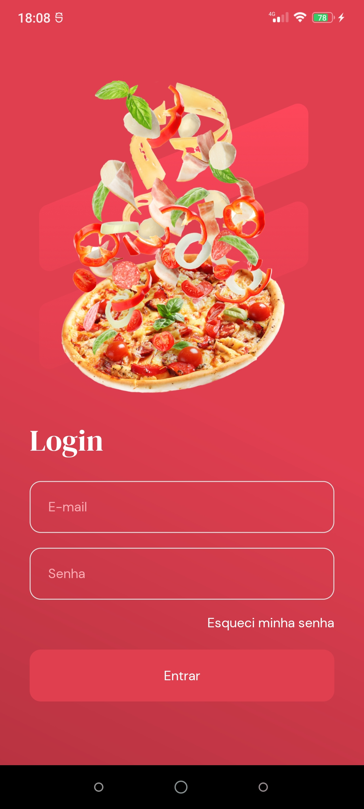
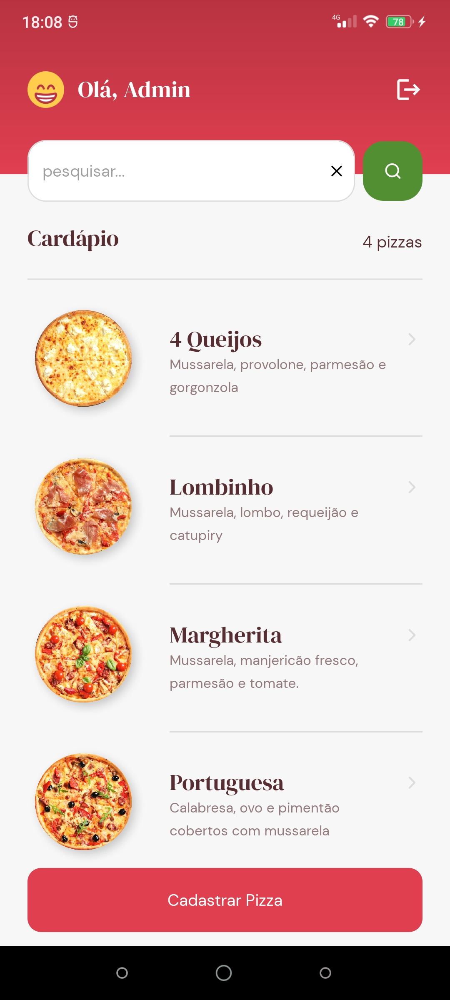
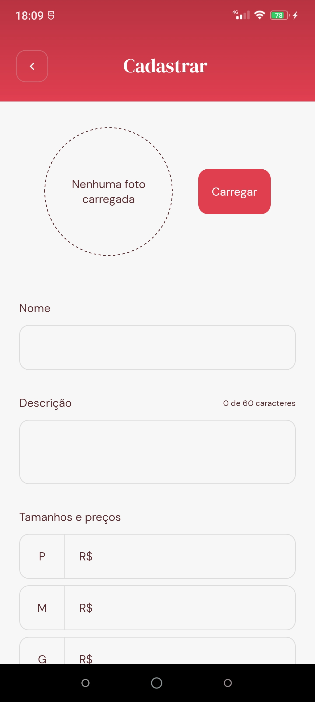
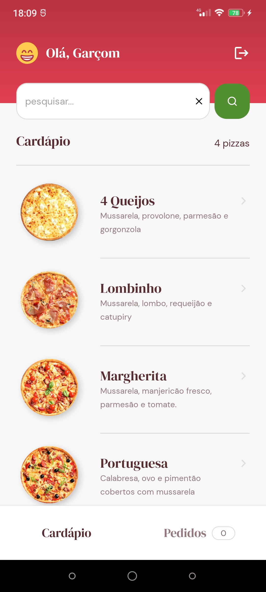
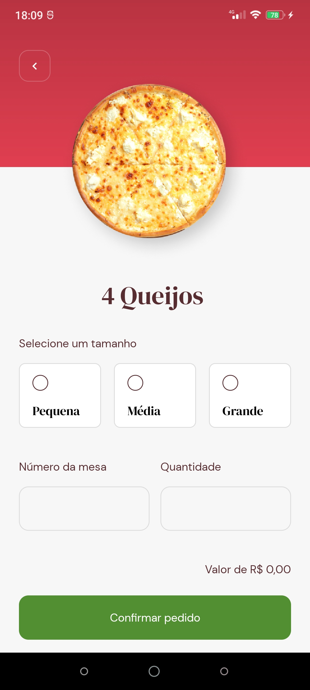

# GoPizza

## 📌 Sobre

Aplicativo para auxiliar Garçons de uma Pizzaria.

 - O administrador (Admin) cadastra o cardápio da pizza;

 - O Garçom anota o pedido do cliente e acompanha o processo de preparo da pizza;

 - Para salvar os usuários (admin e garçom), salvar o cardápio da pizza e os pedidos dos clientes foi utilizado o React Native Firebase. Utilizando Firebase Auth para realizar a autenticação dos usuários, Firebase Storage para salvar as imagens das pizzas e Firebase Firestore para salvar o acesso do Admin e Garçom, além de salvar os pedidos. 

## ⚒ Tecnologias

 - React Native;

 - Expo Bare Workflow;

 - React Native Firebase;

 - Firebase Cloud Firestore;

 - Firebase Cloud Auth;

 - Firebase Storage;

 - Expo Image Picker;

 - Expo Linear Gradient;

 - AsyncStorage;

 - Styled-components;

 - useContext;

 - React Navigation (Stack Navigation e Tab Navigation);

 - Typescript;

## :camera: Screenshots

#### Tela de Login

  

#### Telas do Administrador

  
  

#### Telas de acesso do Garçom

  
  
  

